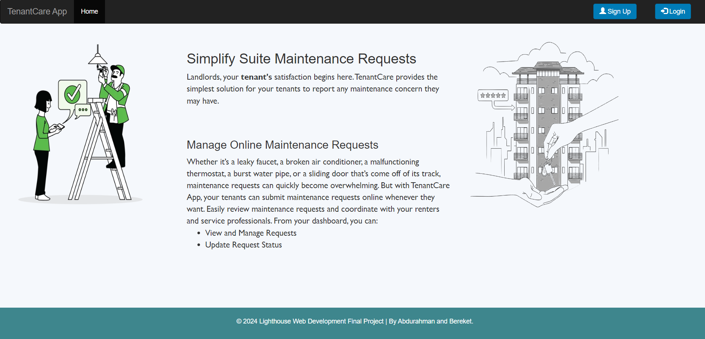
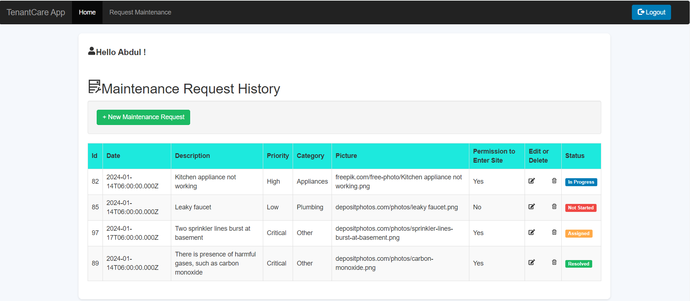
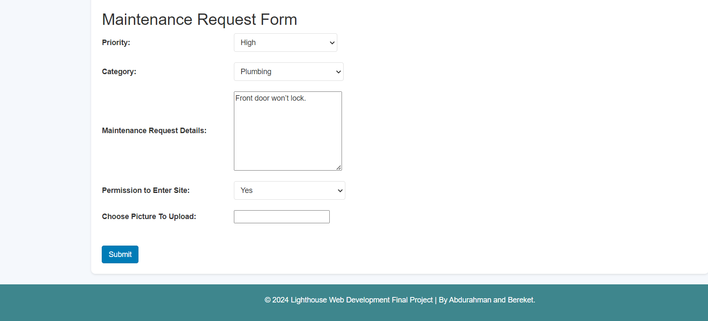
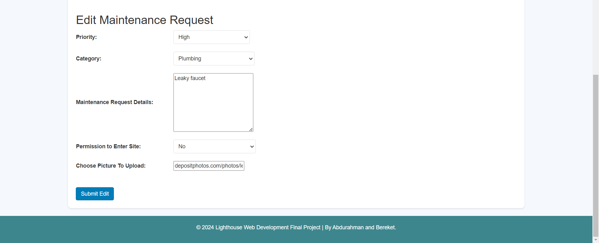
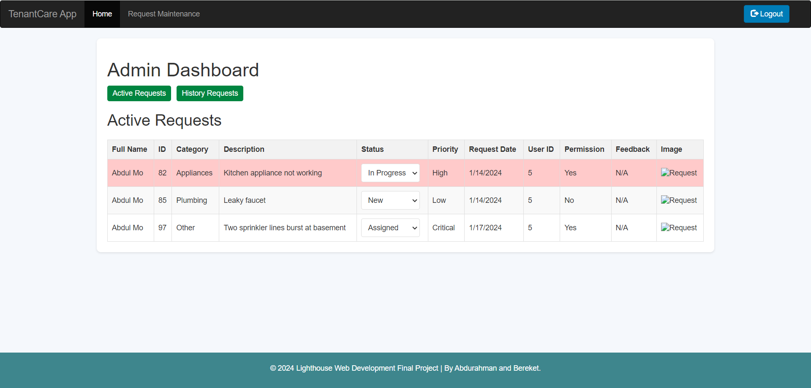

# TenantCare App

TenantCare app is a full-stack web application built with Node.js, Express, PostgreSQL, and React + Vite. The purpose of the TenantCare app is to improve tenants' convenience and enhance operational efficiency for the landlord. The app will enable tenants to submit maintenance requests. This will reduce wait times and ensure a seamless renting experience. End users can perform CRUD operations (Create, Read, Update, Delete).

# Features

- Submit new maintenance request.
- View maintenance request.
- Update request status.
- Send SMS text notification to the tenant.
- Secure user registration and login system.
- Allow users to place maintenance requests by selecting the priority level, category and filling in maintenance repair details, and selecting permission to enter the site.
- Users can view past maintenance request and their status.
- The admin can view submitted maintenance requests.
- The admin can update the status of submitted maintenance requests.

# Final Product

## Home Page

## Maintenance Request Page



## Admin Page


# Technologies Used
We’ve applied a Single Page App model to build TenantCare app using Node.js, Express, PostgreSQL and React + Vite.

# Getting Started

- Reset database: `npm run db:reset`
- Install dependencies with `npm install` in each respective /frontend and /backend

### [Frontend] Running Vite Development Server
  ``` 
    cd frontend 
    npx vite 
  ``` 

### [Backend] Running Backend Server
  ``` 
     cd backend
     npm run local
  ```
# Dependencies

- Node v16.15.1
- NPM 6.x or above
- Bcrypt 5.1.1
- Cookie-session 2.0.0
- Cors 2.8.5
- Dotenv 2.0.0
- Express 4.17.1
- Morgan 1.9.1
- PSQL
- Twilio 5.0.0-rc.1
- Axios 1.6.3
- React 18.2.0
- React-dom 18.2.0
- React-icons 4.12.0
- React-router-dom 6.21.1